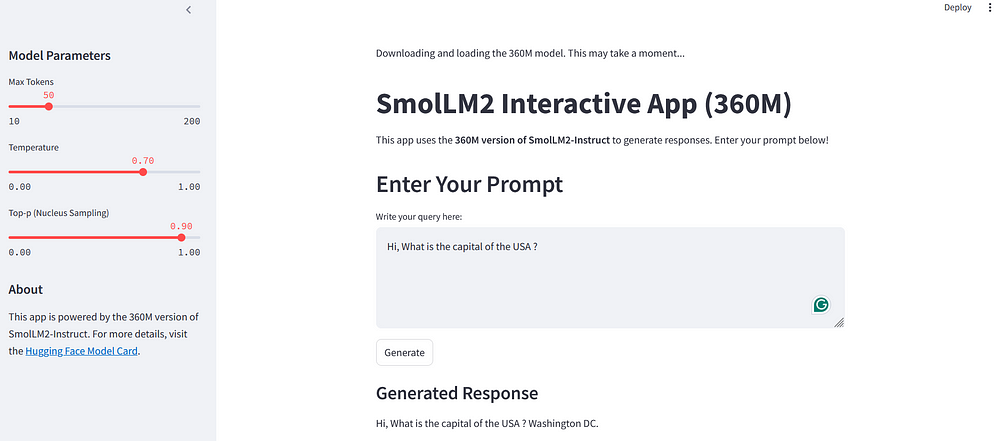

Here's a **`README.md`** file for your Streamlit app:

---

# SmolLM2 Interactive Streamlit App (360M)



This repository hosts a **Streamlit app** powered by the **SmolLM2-Instruct 360M model**, a lightweight pre-trained language model for interactive text generation. The app is designed to generate human-like responses based on user inputs, making it a great tool for text-based tasks like brainstorming, creative writing, or question-answering.

---

## 🚀 **Features**
- **Pre-trained Model Integration**: Utilizes the 360M version of SmolLM2-Instruct from Hugging Face.
- **Interactive Prompt Input**: Users can enter prompts and receive AI-generated responses in real-time.
- **Customizable Parameters**: Adjust model generation parameters such as:
  - `Max Tokens`
  - `Temperature`
  - `Top-p (Nucleus Sampling)`
- **Optimized Performance**:
  - Uses FP16 for reduced memory footprint.
  - Automatically leverages GPU when available.
- **Explanation Section**: Learn how the app works with detailed insights provided in the UI.

---

## 📋 **Setup and Installation**

### Prerequisites
- Python 3.8 or later.
- [Streamlit](https://streamlit.io/) library installed.
- [PyTorch](https://pytorch.org/) and Hugging Face's `transformers` package installed.

### Installation
1. Clone the repository:
   ```bash
   git clone https://github.com/your-username/smollm2-app.git
   cd smollm2-app
   ```
2. Install the required dependencies:
   ```bash
   pip install -r requirements.txt
   ```

3. Run the Streamlit app:
   ```bash
   streamlit run app.py
   ```

---

## 🛠️ **How It Works**

1. **Model Loading**:
   - Downloads the 360M SmolLM2 model checkpoint from Hugging Face on the first run.
   - Caches the model to avoid repeated downloads.

2. **Input and Interaction**:
   - Enter a prompt in the text box.
   
   - Fine-tune generation parameters using the sidebar sliders.
    
3. **Response Generation**:
   - The app processes the input prompt, generates text using the model, and displays the output in real time.
    
---

## 🖥️ **UI Layout**
- **Main Page**:
  - Prompt input text area.
  - Output section displaying AI-generated responses.
- **Sidebar**:
  - Model parameter sliders for `Max Tokens`, `Temperature`, and `Top-p`.
  - About section with model details and a link to the Hugging Face model card.
- **Explanation Section**:
  - An overview of how the app works, optimized for user understanding.

---

## 📚 **Model Information**
This app is powered by the [SmolLM2-Instruct 360M model](https://huggingface.co/HuggingFaceTB/SmolLM2-360M-Instruct), a lightweight pre-trained language model designed for instruction-based tasks. It balances performance and computational efficiency, making it suitable for applications requiring fast responses and moderate hardware resources.

---

## 💡 **Customizing the App**
Feel free to modify the following:
- **Model Checkpoint**: Replace the default checkpoint with another Hugging Face model.
- **UI Elements**: Add more controls, explanations, or styling to enhance the user experience.

---

## 📄 **License**
This project is licensed under the MIT License. See the [LICENSE](LICENSE) file for details.

---

## ✨ **Acknowledgments**
- [Hugging Face](https://huggingface.co/) for providing pre-trained models.
- [Streamlit](https://streamlit.io/) for enabling easy and interactive app development.
- [PyTorch](https://pytorch.org/) for powering the backend model computations.

---
